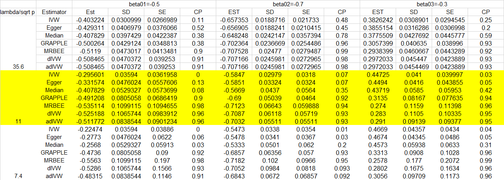

# MRBEE Simulation

This project offers the codes used in our paper MRBEE ([BioRxiv link](https://www.biorxiv.org/content/10.1101/2023.01.10.523480v3.abstract)).

## Files Description

### Rcppfunction.R and basicfunction.R 
Define the basic functions used in this simulation.

### mainprogram.R 
Describes the codes for simulation.

### non_pleiotropy_case.R, unbalanced_uhp_case.R, and correlated_pleiotropy_case.R 
Consider the three main cases: no pleiotropy, 30% unbalanced uncorrelated horizontal pleiotropy, and 30% correlated horizontal pleiotropy case. You can change `M` (the number of IVs) and `overlap` (0: 0% sample overlap and 1: 100% sample overlap).

### replication_of_dIVW_simulation.R
Replicates the simulations for the latest dIVW method ([arXiv link](https://arxiv.org/pdf/2402.00307.pdf)). We noticed discrepancies in the performance of MRBEE compared to the results shared in our preprint. Consequently, we replicate the simulations to identify the issues with MRBEE. 
In both our simulations and actual data analyses, MRBEE operates on standardized GWAS data. The data in your simulations were not standardized, leading to highly unreliable estimates from MRBEE. This issue can be easily fixed by standardizing at the beginning of the function:
```R
by = by / byse
byseinv = 1 / byse
bX = bX * byseinv
bXse = bXse * byseinv
byse1 = byse
byse = byse / byse
```
We have already fixed this bug. Using the corrected function and dIVW's code (https://github.com/yinxiangwu/Debiased.MVMR.simulations), we replicated the scenarios in simulation_study1.R, and remade the table corresponding to Table 1 in the article. Based on the updated MRBEE, we found that in most cases, MRBEE performs similarly to dIVW, but with a higher coverage frequency. This is due to MRBEE's adjusted variance calculation, which does not use the standard sandwich formula. adIVW and MRBEE can be considered different methods: adIVW has less bias and smaller SD.



## Contact

Yihe Yang
Email: yxy1234@case.edu
ORCID: 0000-0001-6563-3579

## License

MIT License
